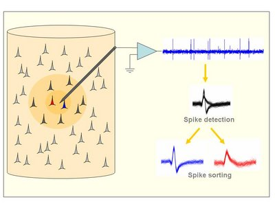

# Neural manifolds - Project for TDA
## Resources
- [video by Artem Kirsanov](v=QHj9uVmwA_0&ab_channel=ArtemKirsanov)
- data download [here](https://crcns.org/data-sets/thalamus/th-1/about-th-1.) 
- [this article](https://www.researchgate.net/publication/273064711_Internally_organized_mechanisms_of_the_head_direction_sense) describes how it was created from experiments with mice.

## My understanding of used data collection and preprocessing methods
### Spike sorting - creation of "clusters"
Extracellular recordings are usually done by inserting microwires in the brain. The signal from the microwire is amplified and band-pass filtered and the firing of the nearby neurons appears as spikes on top of background activity. Spikes are detected using an amplitude threshold and then sorted according to their shapes. For neurons close to the electrode tip -about 50 to 100 microns (Gerstein and Clark, 1964; Buzsaki, 2004)- the signal-to-noise ratio is good enough to distinguish the activity of each single unit (inner circle). For more distant neurons (outer circle) -up to about 150 microns- spikes can be detected but the difference in their shapes is masked by the noise (multi-unit activity). Spikes from neurons further apart cannot be detected and they contribute to the background noise activity.

[Spike sorting](http://www.scholarpedia.org/article/Spike_sorting#:~:text=Spike%20sorting%20is%20the%20grouping,activity%20of%20different%20putative%20neurons) is the grouping of spikes into clusters based on the similarity of their shapes. Given that, in principle, each neuron tends to fire spikes of a particular shape, the resulting clusters correspond to the activity of different putative neurons. The end result of spike sorting is the determination of which spike corresponds to which of these neurons.

 

### ISOMAP - dimensionality reduction technique
In `run_spud_multiple_tests.py` they use ISOMAP implementation from sklearn https://scikit-learn.org/stable/modules/generated/sklearn.manifold.Isomap.html.

YT video: https://www.youtube.com/watch?v=Xu_3NnkAI9s&ab_channel=AppliedAlgebraicTopologyNetwork

Isomap is a nonlinear dimensionality reduction method. It is one of several widely used low-dimensional embedding methods. [1] Isomap is used for computing a quasi-isometric, low-dimensional embedding of a set of high-dimensional data points. The algorithm provides a simple method for estimating the intrinsic geometry of a data manifold based on a rough estimate of each data point’s neighbors on the manifold. Isomap is highly efficient and generally applicable to a broad range of data sources and dimensionalities.

## What's inside the raw data directory
Note: `<n>` indicates id of shank (physical element of used electrode, one electrode has multiple shanks) that measured given signal and `<mouse>` is the name of session, like `Mouse28-140313`:

- `<mouse>.ang`: changes of physically measured angle over time
- `<mouse>/clu.<n>`: text file of cluster identities. The first number – total number of clusters, where cluster with index 0 represents artifacts, 1 – noise/nonclusterable units, 2 and above – isolated units.
- `<mouse>.eeg`: local field potential data downsampled to 1250Hz
- `<mouse>.fet.<n>`: features array of spike waveform including:
    - total number of dimensions in the feature space. Typically, for each channel there are 3 PCAs, and on top of this there are 3 features coding peak-to-trough, peak-tobaseline and trough-to-baseline of the spike on the channel of largest amplitude,
    - spike width 
    - time of the spike (identical to `<mouse>.res.<n>`.)
- `<mouse>.pos`: ?
- `<mouse>.res.<n>`: test file containing spike timestamps.  The time stamps are in samples at 20kHz sampling rate.
- `<mouse>.spk.<n>`: binary file of spike waveshape. The waveshape of each spike across channels are written consecutively in the multiplexed form as in .dat file. The width of each spike is 32 samples, with sample #15 being the trough of spike.
- `<mouse>.states.REM`: ?
- `<mouse>.states.Wake`: ?
- `<mouse>.whl`: text file of the position of the animal extracted from the video file. Each row is a frame in the movie. Sampling rate 39.06 Hz. The samples are synchronized with the electrophysiology. First two columns code for (x,y) coordinates, respectively, of the first LED, last two – of the second. -1 means
adequate tracking was not possible for these frames.
- `<mouse>.xml`: technical configuration file associated with session

## Summary of what I've done so far with dataset and public repo code
1. Converted all scripts for use with python3
2. Did setup described in README (params, processing of raw data)
3. Read an article about spike sorting (part of data preprocessing)
4. Split run_spud_multiple_tests.py into two jupyter notebooks
5. Converted `run_persistent_homology.py` into a notebook and added a new persistence diagram.
6. Changed sampling method to the one implemented by ripser.py authors ("furthest point sampling")
7. Examined outputs of ripser function to understand what it returns and how the results can be used
8. Analyzed how barcodes are plotted

## What each script / file does:
- `general_params/`:
    - `area_shank_info.pkl`: contains dict where keys are session names (like `"Mouse17-130320"`) and values are maps from brain region (like `ADn`) to list of shank ids in it (like `[1, 2]`)
    - `general_params.pkl`: config file created by running `make_general_params_file.py`
    - `make_general_params_file.py`: running this script creates `general_params.pkl`, which should be done at the beginning of workflow
- `manifold_and_decoding/`:
    - `decode_from_saved_fit.py`
    - `run_dimensionality_reduction.py`
    - `run_persistent_homology.py`
    - `run_spud_interactive.py`
    - `run_spud_multiple_tests.py`
- `read_in_data/`:
    - `data_read_fns.py`: utlitity functions for reading data from files
    - `preprocess_raw_data.py`: running this script creates two new pickle files containing processed data
    - `rate_functions.py`
- `shared_scripts/`:
    - `angle_fns.py`
    - `binned_spikes_class.py`
    - `dim_red_fns.py`
    - `distribution_fns.py`
    - `fit_helper_fns.py`
    - `general_file_fns.py`
    - `manifold_fit_and_decode_fns.py`
    - `sweep_fns.py`

## Order of execution - what are the steps of the workflow
1. raw data is converted to pickle files containing processed data
2. Betti numbers are computed for data cloud
3. Isomap dimensionality reduction is performed on processed data - now we have points in 3D space
4. SPUD